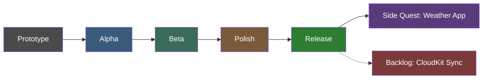

# Daily Planner — Development Roadmap

Roadmap ini pakai istilah produksi game (Prototype → Alpha → Beta → Polish → Release) supaya familiar buat background game dev. Setiap fase punya tujuan, deliverable konkret, dan "Definition of Done" (DoD) — mirip milestone review di production pipeline game.

---

## Prototype
**Tujuan:** Validasi konsep & struktur data, tanpa persistence — cuma buat mastiin "gameplay loop" (alur pakai app) masuk akal.

**Deliverable:**
- Data model dasar: `Task`, `Transaction` (plain struct, belum `@Model`)
- UI list statis pakai dummy/mock data
- Navigasi dasar: `TabView` dengan 2 tab (Tasks, Budget)

**Definition of Done:** Bisa navigasi antar tab, list nampilin dummy data dengan layout yang masuk akal. Belum ada logic nyata.

---

## Alpha
**Tujuan:** Fitur inti "playable end-to-end" — data beneran tersimpan dan bisa dimanipulasi.

**Deliverable:**
- SwiftData persistence aktif (`@Model` untuk `Task`, `Transaction`, `Category`)
- CRUD lengkap: tambah/edit/hapus Task & Transaction
- Navigasi penuh: list → detail/edit → kembali

**Definition of Done:** Tutup app, buka lagi, data masih ada. Semua CRUD jalan tanpa crash.

---

## Beta
**Tujuan:** Fitur "content complete" — semua sistem utama sudah ada, tinggal dirapikan.

**Deliverable:**
- Swift Charts: grafik spending by category, grafik task completion trend
- Local Notification: reminder task (due date), alert saat budget mendekati/lewat limit
- State handling: loading state, empty state, error state di tiap list
- Dark mode support

**Definition of Done:** Semua fitur dari brief awal sudah ada dan berfungsi, walau UI belum final polish.

---

## Polish
**Tujuan:** "Juice" — bikin app terasa production-quality, bukan cuma berfungsi.

**Deliverable:**
- Animasi transisi (list insert/delete, sheet presentation)
- Accessibility: VoiceOver labels, Dynamic Type support
- Unit test untuk ViewModel & data layer (business logic, bukan UI)
- Review konsistensi spacing, warna, typography

**Definition of Done:** App terasa halus dipakai, ada test coverage untuk logic inti, lolos accessibility check dasar.

---

## Release
**Tujuan:** Siap dipamerkan ke recruiter/publik.

**Deliverable:**
- README lengkap: demo GIF, tech stack, penjelasan arsitektur singkat, cara run
- Build ke TestFlight (opsional tapi sangat disarankan)
- Push ke GitHub dengan commit history yang rapi (bukan 1 commit besar)

**Definition of Done:** Orang lain bisa lihat/coba app tanpa perlu penjelasan tambahan dari kamu.

---

## Side Quest: Weather App
**Tujuan:** Project pelengkap kecil — skill berbeda (REST API publik + WidgetKit), scope sengaja dibatasi supaya cepat selesai.

**Deliverable:**
- Fetch data dari weather API publik
- UI current weather sederhana (1 layar utama)
- WidgetKit home screen widget

**Definition of Done:** Widget nampilin cuaca terkini di home screen, app-nya sendiri ringan dan fokus.

---

## Backlog (Later)
- **CloudKit Sync** untuk Daily Planner — sengaja ditunda dari Alpha/Beta karena kompleksitas conflict-resolution & schema migration. Ditambahkan setelah app dasar stabil (pasca-Release), sebagai "v2" atau DLC.
