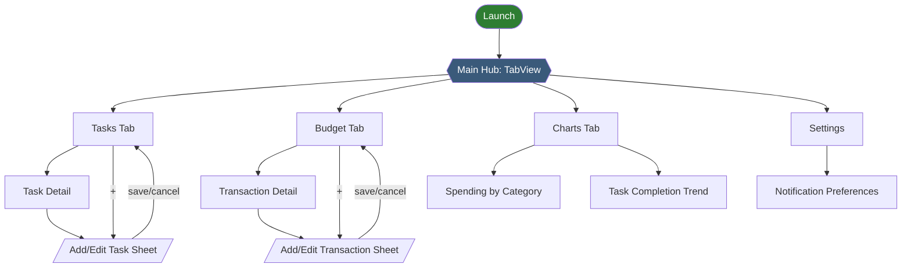
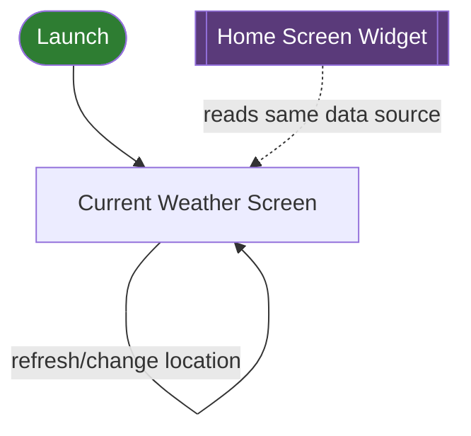

# App Flow

Alur layar/navigasi, dianalogikan seperti scene flow di game — tiap layar = "scene", tiap tab = "hub area".

## Daily Planner

**Catatan navigasi:**
- `Main Hub` adalah `TabView` persisten — user selalu bisa balik ke salah satu tab tanpa reset state tab lain.
- `Add/Edit` sheet dipakai untuk create maupun update (form yang sama, judul berubah sesuai konteks).
- `Settings` diakses dari Hub (bukan salah satu tab utama) — analog "pause menu" di game, bisa diakses dari mana saja.

## Weather App (Side Quest)

Scope sengaja lebih simpel — cuma 1 alur utama, tanpa banyak percabangan.

