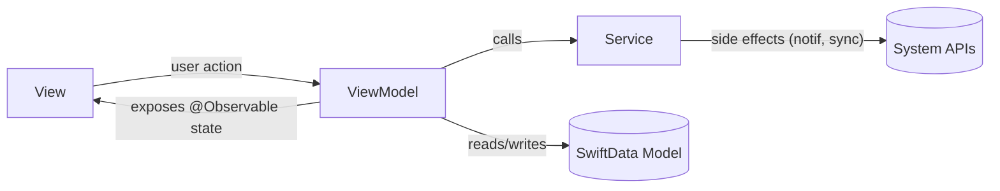

# Architecture: MVVM

Daily Planner pakai **MVVM (Model-View-ViewModel)** — pola arsitektur standar industri untuk SwiftUI. Supaya lebih familiar dari sisi game dev, tiap layer dipetakan ke konsep yang biasa ditemui di game engine (Unity/Unreal-style).

> Catatan: sebelumnya disebut "MVVC" di percakapan — diasumsikan maksudnya **MVVM**, karena itu pola standar SwiftUI dan paling relevan dengan kebutuhan industri. Kalau yang dimaksud beda, kabari supaya arsitekturnya disesuaikan.

## Pemetaan Layer

| MVVM Layer | Peran | Analogi Game Dev |
|---|---|---|
| **Model** | Struktur data murni (`Task`, `Transaction`, `Category`), pakai SwiftData `@Model` untuk persistence | Data container (mirip `ScriptableObject` / save data struct) — cuma nyimpen state, nggak ada logic UI |
| **ViewModel** | Class `@Observable` per screen, pegang state & business logic, expose data siap-render ke View | Manager/Controller class (mirip `GameManager`, `InventoryManager`) — atur logic & state, di-observe oleh UI |
| **View** | SwiftUI View, murni render dari state ViewModel, forward user input ke ViewModel | Scene/UI layer — cuma nampilin apa yang manager kasih, nggak nyimpen logic sendiri |
| **Service** | Class terpisah untuk side-effect: `NotificationService`, nanti `SyncService` (CloudKit) | System/singleton service (mirip `AudioManager`, `SaveSystem`) — dipanggil ViewModel, nggak diakses langsung dari View |

## Alur Data



- **View** tidak pernah langsung akses SwiftData atau Service — semua lewat ViewModel.
- **ViewModel** tidak tahu apa-apa soal SwiftUI (tidak import `SwiftUI` kecuali untuk `@Observable`/state types) — supaya gampang di-unit-test tanpa render UI.
- **Service** stateless sebisa mungkin — dipanggil, ngerjain side effect, return hasil/error ke ViewModel.

## Struktur Folder

```
DailyPlanner/
├── Models/
│   ├── Task.swift
│   ├── Transaction.swift
│   └── Category.swift
├── ViewModels/
│   ├── TaskListViewModel.swift
│   ├── BudgetViewModel.swift
│   └── ChartsViewModel.swift
├── Views/
│   ├── Tasks/
│   ├── Budget/
│   ├── Charts/
│   └── Settings/
├── Services/
│   ├── NotificationService.swift
│   └── SyncService.swift   # ditambahkan saat fase CloudKit (Backlog)
└── Resources/
    ├── Assets.xcassets
    └── Localizable.strings
```

Struktur ini sengaja dipisah per layer (bukan per fitur) di tahap awal karena project masih kecil — gampang di-refactor jadi per-fitur nanti kalau app tumbuh besar.
